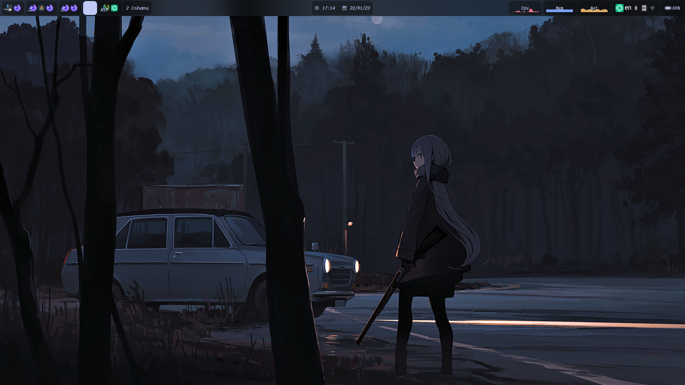
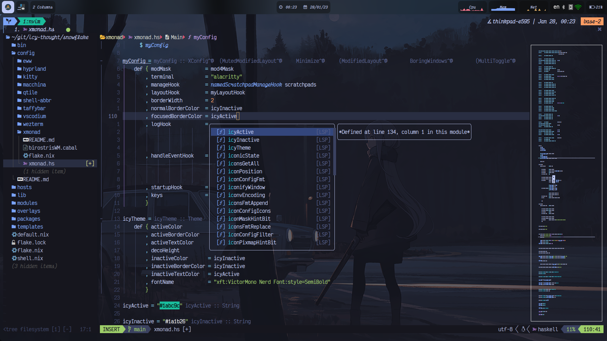

<p align="center">
    
</p>

<p align="center">
    <a href="https://github.com/Icy-Thought/Snowflake/stargazers">
        
    </a>
    <a href="https://github.com/Icy-Thought/Snowflake/issues">
        
    </a>
</p>

<div align="center">
    <h4>
        <a href="https://github.com/Icy-Thought/nvim.d">Neovim Conf</a>
        <span> | </span>
        <a href="https://github.com/Icy-Thought/emacs.d">Emacs Conf</a>
        <span> | </span>
        <a href="https://github.com/Icy-Thought/Lost-in-Space">Deprecated Conf</a>
    </h4>
</div>

# Table of Contents

- [Desktop Preview](#desktop-preview)
  - [XMonad](#xmonad)
  - [Neovim](#neovim)
- [Introduction](#introduction)
- [Getting Started](#getting-started)
  - [Prepare System Environment for Nix-Flake](#prepare-system-environment-for-nix-flake)
- [Nix-Flake: Beginning of a Journey](#nix-flake-beginning-of-a-journey)
  - [Clone `Snowflake` and Link Files To Dir](#clone-snowflake-and-link-files-to-correct-path)
  - [Replacing Necessary Configuration Entries](#replacing-necessary-configuration-entries)
    - [Create Your Hosts Directory](#create-your-hosts-directory)
    - [Hardware-Configuration.nix](#hardware-configurationnix)
    - [Hide Your FileSystem From Nautilus & Dolphin](#hide-your-filesystem-from-nautilus--dolphin)
    - [Installing Nix-Flake System](#installing-nix-flake-system)
- [(Optional) Doom Emacs](#doom-emacs)
- [Congratulations! 🎉](#congratulations-)
- [Useful Links](#useful-links)
- [Special Thanks](#special-thanks)

# Desktop Preview

## XMonad



## Neovim



# Introduction

A hamerspace containing a declarative NixOS environment consisting of many
hand-crafted configurations, ranging from: Kitty, Alacritty, Doom-Emacs, Zathura
to many other applications which can be found in the `./home` directory.

> **Warning** This repository, similar to other dotfile/configuration
> repositories, is subjected to change.
>
> The reader ought to read through the commit history before blindly cloning,
> fetching or updating the necessary files required to power up their NixOS
> environment!

In this README I will attempt to explain how to replicate my NixOS setup or
achieve similar feats. If you find this guide not as useful as it was designed
to be, do submit an issue requesting a change for the specific sections you
found to be confusing. _Or_ submit a push request (PR) to this repository and
hopefully we can produce better results together!

Throughout my Nix journey, I've came across two interesting projects and among
those projects are [Nix-Flakes](https://github.com/NixOS/nix) and
[Home-Manager](https://github.com/nix-community/home-manager). (_Both projects
will be introduced later in this README._) These projects have been setup in
such manner that allows its users to carefully tune their system environments to
their liking!

> One should note that this project is still in its early stages! Henceforth one
> should familiarize themselves with the
> [Risks](https://github.com/nix-community/home-manager#words-of-warning) that
> comes with the usage of such experimental features.

# Getting Started

## NixOS Installer

As of `22.05` the NixOS ISO comes equipped with a well-developed installer that
reduces the "_complexity_" of installing NixOS on your device! Therefore manual
intervention should not be required for a minimal installation.

## Prepare System Environment for Nix-Flake

Don't forget to append the following lines of code to your `configuration.nix`:

```nix
nix.package = pkgs.nixUnstable;
nix.extraOptions = ''
  experimental-features = nix-command flakes
'';
```

# Nix-Flake: Beginning of a Journey

## Clone `Snowflake` and Link Files To Correct Path

`git clone` your desired repository and because this guide is written with my
personal flake repository in mind:

```sh
git clone https://github.com/Icy-Thought/Snowflake.git
```

Backup the contents of your current `/etc/nixos` directory, you'll need your
auto-generated `hardware-configuration.nix` file to later place it inside its
specified `hosts/deviceX` (where `deviceX` is the name of your device folder.

## Replacing Necessary Configuration Entries

### Remove `wgConnect` Directory

> **Note** Files contained within the `wgConnect` directory are intended for my
> personal usage.

_**Command**_ :

```bash
rm -rf ./modules/networking/wgConnect
```

If you choose to retain that directory, make sure to remove the files contained
within that directory and replace it with your personal WireGuard config files.

> **Warning** Failing to do so will result in `nixos-rebuild` failure because of
> the encrypted files!

### Create Your Hosts Directory

Create a directory inside the `hosts` with the name of the desired hostname for
that device; let's call this directory `X`.

```sh
mkdir -p hosts/X
```

Now create a `default.nix` file inside that folder and for the sake of speeding
the process up.

> **Note** I suggest you copy over my `thinkpad-e595/default.nix` to your
> directory (`X`) and later customize it to your liking.

```sh
cd hosts && cp thinkpad-e595/default.nix X
```

### Hardware-Configuration.nix

Place your newly generated `hardware-configuration.nix` inside your `hosts/X`
and make sure to import your `hardware-configuration.nix` in the `default.nix`
file of your device folder.

_(Example): `ThinkPad-E595` defined as a valid system environment._

```sh
import = [ ./hardware-configuration.nix ];
```

### Hide Your FileSystem From Nautilus & Dolphin

> **Note** By default, Nautilus & Dolphin does not hide system partitions from
> mounted devices category.

I have chosen to hide those partitions from the mounted devices category of the
mentioned file managers. I have also added several kernel parameters and other
device-specific configurations for my setup in this repository. (check
`hosts/deviceX`)

What you are required to edit is:

1. `fileSystems` entries in `default.nix`.
2. The specific parts which you wish to exclude from your setup, such as: kernel
   parameters, modules to disable, packages to be installed among other
   configurations.

_(Example): hiding `/boot` from Nautilus mounted devices._

```nix
fileSystems."/boot" = {
  device = "/dev/disk/by-label/BOOT";
  fsType = "vfat";
  options = [ "x-gvfs-hide" ]; # For hiding boot partition entry in Nautilus.
};
```

> Make sure to replace `/dev/disk/by-uuid/xyz` (or `partuuid`) with
> `/dev/disk/by-label/X`, where `X` follows the label you have choosen to name
> your partitions with during your partition setup.

### Installing Nix-Flake System

After completing your setup, there remains one command to be executed (device =
folder name of your device placed inside `hosts`, which in this case is `X`:

```sh
nixos-rebuild switch --use-remote-sudo --flake .#conf-name --impure";
reboot
```

# Doom Emacs

If you have replicated my setup, you need to do nothing but `git clone`
doom-emacs repository and enable the `emacs` module in your `X/default.nix`:

```nix
modules.desktop.editors.emacs.enable = true;
```

To proceed with the installation of doom-emacs on your newly
installed/configured nix-flake system:

```sh
git clone --depth 1 https://github.com/hlissner/doom-emacs ~/.emacs.d
~/.emacs.d/bin/doom install
```

# Congratulations! 🎉

You have successful installed your/my personally hand-crafted/replicated
Nix-Flake environment. I hope it suits your needs, if not then you are always
welcome to propose changes or fork the project and customize the repository to
your heart's content!

# Useful Links

- [NixOS Manual](https://nixos.org/manual/nixos/stable): A manual for the
  newcomer to read and understand different parts of the NixOS distribution.
- [Home-Manager](https://github.com/nix-community/home-manager): Helps you
  manage your `~/home` related configurations.
- [Nix Pills](https://nixos.org/guides/nix-pills): A series written to
  familiarize the user with the Nix programming language.
- [Nixpkgs Unstable](https://nixos.org/manual/nix/unstable): A manual which
  introduces the Nix-language to people unfamiliar with the wonders of this
  language.
- [Nix Flake MVP](https://gist.github.com/edolstra/40da6e3a4d4ee8fd019395365e0772e7):
  A written Nix guide by [edolstra](https://github.com/edolstra).
- [A Tour of Nix](https://nixcloud.io/tour/?id=1): a beautifully crafted
  introduction into the Nix programming language.

# Special Thanks

- [hlissner/dotfiles](https://github.com/hlissner/dotfiles): nix-flake skeleton!
