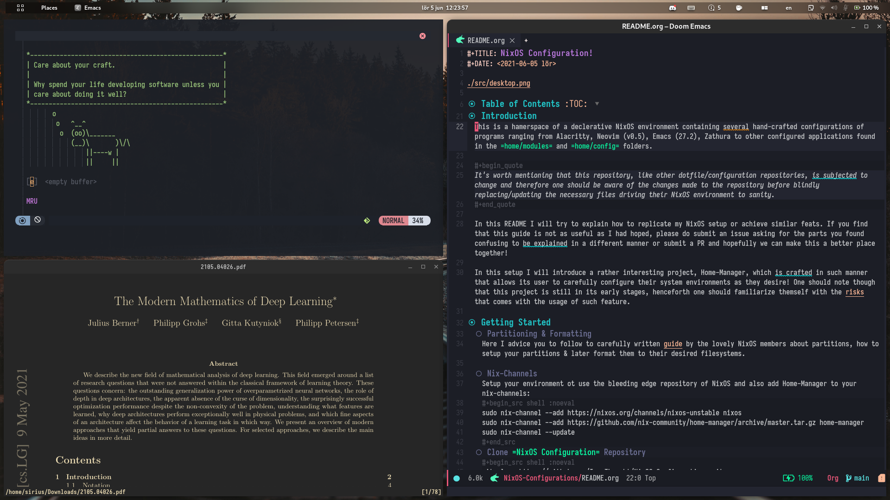

# Introduction

The following folder contains window-managers and desktop-environments I've
tried throughout the years of my NixOS journey.

If there is a missing section for a certain WM/DE in this `README.md`, then do
look in that WM/DE folder, because it most certainly contains a `README.md`
file!

# Gnome

