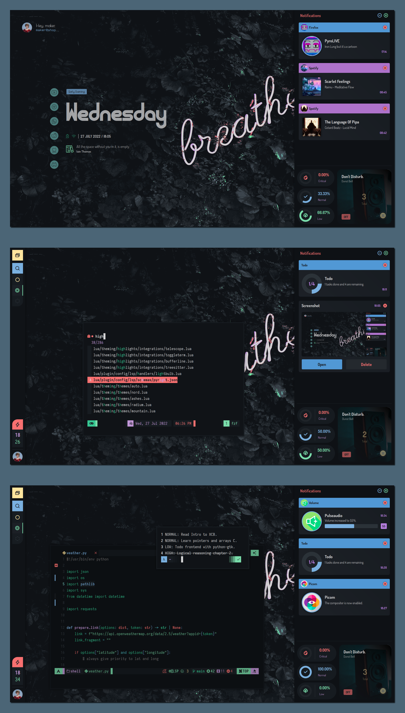

# (def) ElKowar's Wacky Widgets
> Waste of time. Smelly widgets feat. Spaghetti code. -
> [Dharmx](https://github.com/dharmx/vile)

# Temporary Solution!
> **Warning**
> Temporary solution until I find the time to implement my own EWW config.

# Special Thanks
- [Dharmx](https://github.com/dharmx)
