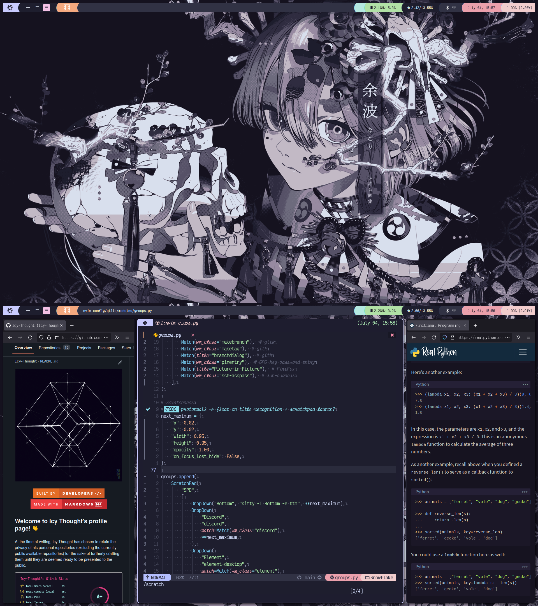

# (def) Qtile
> A full-featured, hackable tiling window manager written and configured in
> Python - [Qtile](http://www.qtile.org)

## Keybindings

### Definitions:
- <kbd>M</kbd> = <kbd>super</kbd> (Windows-Key)
- <kbd>A</kbd> = <kbd>Alt</kbd>
- <kbd>S</kbd> = <kbd>Shift</kbd>
- <kbd>H</kbd> = <kbd>Hyper</kbd> (right-ctrl)

### Action Keybindings

| Keybinding                                      | Action                                                                |
|-------------------------------------------------|-----------------------------------------------------------------------|
| <kbd>M</kbd> + <kbd>S</kbd> + <kbd>/</kbd>      | Run xmessage with a summary of the default keybindings.               |
| <kbd>M</kbd> + <kbd>S</kbd> + <kbd>Return</kbd> | Launch terminal. (Alacritty)                                          |
| <kbd>M</kbd> + <kbd>A</kbd> + <kbd>f</kbd>      | Launch Firefox Browser.                                               |
| <kbd>M</kbd> + <kbd>A</kbd> + <kbd>h</kbd>      | Launch htop.                                                          |
| <kbd>M</kbd> + <kbd>A</kbd> + <kbd>s</kbd>      | Launch Spotify.                                                       |
| <kbd>M</kbd> + <kbd>p</kbd>                     | Invoke rofi to select an application specified in a desktop file.     |
| <kbd>M</kbd> + <kbd>g</kbd>                     | Invoke rofi to select which window the focus will be shifted towards. |
| <kbd>M</kbd> + <kbd>b</kbd>                     | Invoke rofi to bring *X* window to current workspace.                 |
| <kbd>M</kbd> + <kbd>S</kbd> + <kbd>b</kbd>      | Invoke rofi to select a window to replace the active window with.     |
| <kbd>H</kbd> + <kbd>l</kbd>                     | Invoke rofi to select from available layouts.                         |
| <kbd>M</kbd> + <kbd>S</kbd> + <kbd>c</kbd>      | Close focused window.                                                 |
| <kbd>M</kbd> + <kbd>q</kbd>                     | Restart XMonad.                                                       |
| <kbd>M</kbd> + <kbd>S</kbd> + <kbd>q</kbd>      | Quit XMonad.                                                          |

### Window Movement Keybindings

| Keybinding                                         | Action                                                                           |
|----------------------------------------------------|----------------------------------------------------------------------------------|
| <kbd>M</kbd> + <kbd>space</kbd>                    | Cycle through available layouts.                                                 |
| <kbd>M</kbd> + <kbd>S</kbd> + <kbd>space</kbd>     | Reset current workspace layouts to default.                                      |
| <kbd>M</kbd> + <kbd>n</kbd>                        | Resize viewed windows to default size.                                           |
| <kbd>M</kbd> + <kbd>Tab</kbd>                      | Move focus to the next window.                                                   |
| <kbd>M</kbd> + <kbd>S</kbd> + <kbd>Tab</kbd>       | Move focus to the previous window.                                               |
| <kbd>M</kbd> + <kbd>{h,j,k,l}</kbd>                | Move to an adjacent window in the direction associated with the pressed vim-key. |
| <kbd>M</kbd> + <kbd>m</kbd>                        | Minimize active window.                                                          |
| <kbd>M</kbd> + <kbd>S</kbd> + <kbd>m</kbd>         | Maximize active window.                                                          |
| <kbd>M</kbd> + <kbd>Return</kbd>                   | Swap focused window with master window.                                          |
| <kbd>M</kbd> + <kbd>S</kbd> + <kbd>{h,j,k,l}</kbd> | Swap focused window with window in the input direction.                          |
| <kbd>M</kbd> + <kbd>,</kbd>                        | Increment number of windows in master area.                                      |
| <kbd>M</kbd> + <kbd>period</kbd>                   | Deincrement number of windows in master area.                                    |
| <kbd>M</kbd> + <kbd>S</kbd> + <kbd>z</kbd>         | Move active window to an empty workspace.                                        |
| <kbd>M</kbd> + <kbd>S</kbd> + <kbd>h</kbd>         | Move active window to an empty workspace + change to that workspace.             |
| <kbd>M</kbd> + <kbd>C</kbd> + <kbd>space</kbd>     | Activates/Deactivates fullscreen for active window.                              |
| <kbd>M</kbd> + <kbd>x</kbd>                        | Sends active window to hidden workspace.                                         |
| <kbd>M</kbd> + <kbd>A</kbd> + <kbd>space</kbd>     | Minimizes other classes but the active window class.                             |
| <kbd>H</kbd> + <kbd>g</kbd>                        | Gather class of active window to current workspace.                              |

### Window Movement Mouse Keybindings

| Keybinding                        | Action                                       |
|-----------------------------------|----------------------------------------------|
| <kbd>M</kbd> + <kbd>Button1</kbd> | Window -> floating mode, move by dragging.   |
| <kbd>M</kbd> + <kbd>Button3</kbd> | Window -> floating mode, resize by dragging. |
| <kbd>M</kbd> + <kbd>Button2</kbd> | Raise window to top of the stack.            |

### Workspace Movement Keybindings

| Keybinding                                      | Action                                    |
|-------------------------------------------------|-------------------------------------------|
| <kbd>M</kbd> + <kbd>[1..7]</kbd>                | Switch to n-workspace.                    |
| <kbd>M</kbd> + <kbd>S</kbd> + <kbd>[1..7]</kbd> | Move client to n-workspace.               |
| <kbd>H</kbd> + <kbd>e                           | Move to empty workspace.                  |
| <kbd>M</kbd> + <kbd>\\</kbd>                    | Cycles through current workspace history. |

### Screen Movement Keybindings

| Keybinding                                       | Action                                          |
|--------------------------------------------------|-------------------------------------------------|
| <kbd>M</kbd> + <kbd>{w,e,r}</kbd>                | Switch to physical/Xinerama screens 1, 2, or 3. |
| <kbd>M</kbd> + <kbd>S</kbd> + <kbd>{w,e,r}</kbd> | Move client to screen 1, 2, or 3.               |
