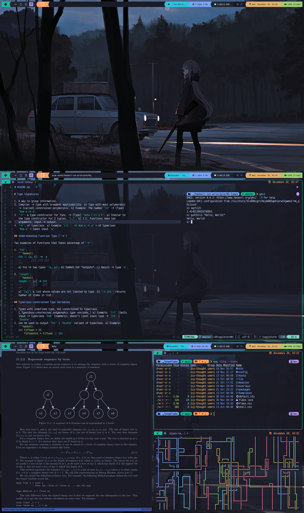

# (def) Qtile

> A full-featured, hackable tiling window manager written and configured in
> Python - [Qtile](http://www.qtile.org)

# NOTE

The following keybindings does not work 100% as expected due to either lack of
implementation or an outdated `README.md`.

## Keybindings

### Definitions:

- <kbd>M</kbd> = <kbd>super</kbd> (Windows-Key)
- <kbd>A</kbd> = <kbd>Alt</kbd>
- <kbd>S</kbd> = <kbd>Shift</kbd>
- <kbd>H</kbd> = <kbd>Hyper</kbd> (right-ctrl)

### Action Keybindings

| Keybinding                                      | Action                                                       |
| ----------------------------------------------- | ------------------------------------------------------------ |
| <kbd>M</kbd> + <kbd>S</kbd> + <kbd>Return</kbd> | Launch terminal                                              |
| <kbd>M</kbd> + <kbd>A</kbd> + <kbd>f</kbd>      | Launch Firefox Browser                                       |
| <kbd>M</kbd> + <kbd>A</kbd> + <kbd>h</kbd>      | Launch Bottom                                                |
| <kbd>M</kbd> + <kbd>A</kbd> + <kbd>s</kbd>      | Launch Music Player                                          |
| <kbd>M</kbd> + <kbd>p</kbd>                     | Rofi -> launch application from desktop-file                 |
| <kbd>M</kbd> + <kbd>S</kbd> + <kbd>p</kbd>      | Rofi -> launch application from path                         |
| <kbd>H</kbd> + <kbd>p</kbd>                     | Rofi -> control systemd units                                |
| <kbd>M</kbd> + <kbd>g</kbd>                     | Rofi -> select window to shift focus towards                 |
| <kbd>M</kbd> + <kbd>b</kbd>                     | Rofi -> bring window + shift focus                           |
| <kbd>M</kbd> + <kbd>S</kbd> + <kbd>b</kbd>      | Rofi -> select window to replace current active window with  |
| <kbd>H</kbd> + <kbd>l</kbd>                     | Rofi -> select from available layouts                        |
| <kbd>M</kbd> + <kbd>S</kbd> + <kbd>c</kbd>      | Close focused window                                         |
| <kbd>M</kbd> + <kbd>S</kbd> + <kbd>r</kbd>      | Restart Qtile                                                |
| <kbd>M</kbd> + <kbd>S</kbd> + <kbd>q</kbd>      | Quit Qtile                                                   |

### Window Movement Keybindings

| Keybinding                                         | Action                                                  |
| -------------------------------------------------- | ------------------------------------------------------- |
| <kbd>M</kbd> + <kbd>space</kbd>                    | Cycle through available layouts                         |
| <kbd>M</kbd> + <kbd>S</kbd> + <kbd>space</kbd>     | Focused window -> fullscreen                            |
| <kbd>M</kbd> + <kbd>n</kbd>                        | Reset resized windows -> default size                   |
| <kbd>M</kbd> + <kbd>Tab</kbd>                      | Focus -> next window                                    |
| <kbd>M</kbd> + <kbd>S</kbd> + <kbd>Tab</kbd>       | Focus -> previous window                                |
| <kbd>M</kbd> + <kbd>{h,j,k,l}</kbd>                | Move -> adjacent window (vim-keys)                      |
| <kbd>M</kbd> + <kbd>m</kbd>                        | Active window -> minimized                              |
| <kbd>M</kbd> + <kbd>S</kbd> + <kbd>m</kbd>         | Minimized window -> maximized                           |
| <kbd>M</kbd> + <kbd>Return</kbd>                   | Focused window -> master window                         |
| <kbd>M</kbd> + <kbd>S</kbd> + <kbd>{h,j,k,l}</kbd> | Focused window -> window in input direction             |
| <kbd>M</kbd> + <kbd>,</kbd>                        | (+) n.windows in master area                            |
| <kbd>M</kbd> + <kbd>period</kbd>                   | (-) n.windows in master area                            |
| <kbd>M</kbd> + <kbd>S</kbd> + <kbd>z</kbd>         | Move active window -> empty workspace                   |
| <kbd>M</kbd> + <kbd>S</kbd> + <kbd>h</kbd>         | Move active window -> empty workspace + goto workspace  |
| <kbd>M</kbd> + <kbd>x</kbd>                        | Active window -> hidden workspace                       |
| <kbd>M</kbd> + <kbd>A</kbd> + <kbd>space</kbd>     | Minimize all classes except active window class         |
| <kbd>H</kbd> + <kbd>g</kbd>                        | Gather active window class -> current workspace         |

### Window Movement Mouse Keybindings

| Keybinding                        | Action                                       |
| --------------------------------- | -------------------------------------------- |
| <kbd>M</kbd> + <kbd>Button1</kbd> | Window -> floating mode, move by dragging    |
| <kbd>M</kbd> + <kbd>Button2</kbd> | Window -> floating mode, resize by dragging  |
| <kbd>M</kbd> + <kbd>Button3</kbd> | Window -> top of stack                       |

### Workspace Movement Keybindings

| Keybinding                                      | Action                                    |
| ----------------------------------------------- | ----------------------------------------- |
| <kbd>M</kbd> + <kbd>[1..9]</kbd>                | Switch to n-workspace                     |
| <kbd>M</kbd> + <kbd>S</kbd> + <kbd>[1..9]</kbd> | Move client to n-workspace                |
| <kbd>H</kbd> + <kbd>e                           | Move to empty workspace                   |
| <kbd>M</kbd> + <kbd>\\</kbd>                    | Cycles through current workspace history  |

### Screen Movement Keybindings

| Keybinding                                       | Action                                          |
| ------------------------------------------------ | ----------------------------------------------- |
| <kbd>M</kbd> + <kbd>{w,e,r}</kbd>                | Switch to physical/Xinerama screens 1, 2, or 3. |
| <kbd>M</kbd> + <kbd>S</kbd> + <kbd>{w,e,r}</kbd> | Move client to screen 1, 2, or 3                |
