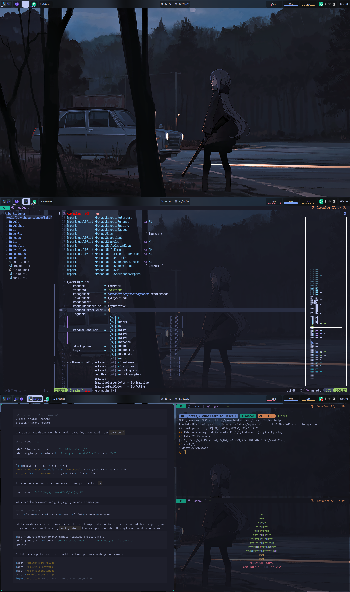

# (>>=) XMonad

> A dynamically tiling X11 window manager that is written and configured in
> Haskell. - [XMonad](https://xmonad.org)

## Keybindings

_Credits:_
[micrub](https://gist.github.com)/[xmonad-default-key-bindings.md](https://gist.github.com/micrub/aeebe7eb4d2df9e5e203e76a0fd89542)

### Definitions:

- <kbd>modm</kbd> = <kbd>super</kbd> (windows key)
- <kbd>hold-cap</kbd> (KMonad) = <kbd>modalt</kbd> = <kbd>super</kbd> +
  <kbd>alt</kbd>
- <kbd>hold-tab</kbd> (KMonad) = <kbd>hyper</kbd> = <kbd>super</kbd> +
  <kbd>ctrl</kbd> + <kbd>shift</kbd>

### Action Keybindings

| Keybinding                                             | Action                                                      |
| ------------------------------------------------------ | ----------------------------------------------------------- |
| <kbd>modm</kbd> + <kbd>shift</kbd> + <kbd>/</kbd>      | XMessage -> summary of default keybindings                  |
| <kbd>modm</kbd> + <kbd>shift</kbd> + <kbd>return</kbd> | Launch terminal                                             |
| <kbd>modm</kbd> + <kbd>alt</kbd> + <kbd>f</kbd>        | Launch FireFox Browser                                      |
| <kbd>modm</kbd> + <kbd>alt</kbd> + <kbd>b</kbd>        | Launch btop++                                               |
| <kbd>modm</kbd> + <kbd>alt</kbd> + <kbd>s</kbd>        | Launch Music Player                                         |
| <kbd>modm</kbd> + <kbd>p</kbd>                         | (Rofi) Power-menu                                           |
| <kbd>modm</kbd> + <kbd>shift</kbd> + <kbd>p</kbd>      | (Rofi) Application launcher                                 |
| <kbd>modm</kbd> + <kbd>g</kbd>                         | (Rofi) select window to shift focus towards                 |
| <kbd>modm</kbd> + <kbd>b</kbd>                         | (Rofi) bring window + shift focus                           |
| <kbd>modm</kbd> + <kbd>shift</kbd> + <kbd>b</kbd>      | (Rofi) select window to replace current active window with  |
| <kbd>hyper</kbd> + <kbd>l</kbd>                        | (Rofi) select from available layouts                        |
| <kbd>modm</kbd> + <kbd>shift</kbd> + <kbd>c</kbd>      | Close focused window                                        |
| <kbd>modm</kbd> + <kbd>q</kbd>                         | Restart XMonad                                              |
| <kbd>modm</kbd> + <kbd>shift</kbd> + <kbd>q</kbd>      | Quit XMonad                                                 |

### Window Movement Keybindings

| Keybinding                                                | Action                                                  |
| --------------------------------------------------------- | ------------------------------------------------------- |
| <kbd>modm</kbd> + <kbd>space</kbd>                        | Cycle through available layouts                         |
| <kbd>modm</kbd> + <kbd>shift</kbd> + <kbd>space</kbd>     | Reset current workspace layout -> default               |
| <kbd>modm</kbd> + <kbd>n</kbd>                            | Reset resized window -> default size                    |
| <kbd>modm</kbd> + <kbd>Tab</kbd>                          | Focus -> next window                                    |
| <kbd>modm</kbd> + <kbd>shift</kbd> + <kbd>Tab</kbd>       | Focus -> previous window                                |
| <kbd>modm</kbd> + <kbd>{h,j,k,l}</kbd>                    | Move -> adjacent window (vim-keys)                      |
| <kbd>modm</kbd> + <kbd>m</kbd>                            | Active window -> minimized                              |
| <kbd>modm</kbd> + <kbd>shift</kbd> + <kbd>m</kbd>         | Minimized window -> maximized                           |
| <kbd>modm</kbd> + <kbd>Return</kbd>                       | Focused window -> master window                         |
| <kbd>modm</kbd> + <kbd>shift</kbd> + <kbd>{h,j,k,l}</kbd> | Focused window -> window in input direction             |
| <kbd>modm</kbd> + <kbd>,</kbd>                            | (+) n.windows in master area                            |
| <kbd>modm</kbd> + <kbd>period</kbd>                       | (-) n.windows in master area                            |
| <kbd>modm</kbd> + <kbd>shift</kbd> + <kbd>z</kbd>         | Move active window -> empty workspace                   |
| <kbd>modm</kbd> + <kbd>shift</kbd> + <kbd>h</kbd>         | Move active window -> empty workspace + goto workspace  |
| <kbd>modm</kbd> + <kbd>ctrl</kbd> + <kbd>space</kbd>      | Focused window -> fullscreen                            |
| <kbd>modm</kbd> + <kbd>x</kbd>                            | Active window -> hidden workspace                       |
| <kbd>modalt</kbd> + <kbd>space</kbd>                      | Minimize all classes except active window class         |
| <kbd>hyper</kbd> + <kbd>g</kbd>                           | Gather active window class to current workspace         |

### Window Movement Mouse Keybindings

| Keybinding                           | Action                                       |
| ------------------------------------ | -------------------------------------------- |
| <kbd>modm</kbd> + <kbd>button1</kbd> | Window -> floating mode, move by dragging    |
| <kbd>modm</kbd> + <kbd>button3</kbd> | Window -> floating mode, resize by dragging  |
| <kbd>modm</kbd> + <kbd>button2</kbd> | Window -> top of the stack                   |

### Workspace Movement Keybindings

| Keybinding                                             | Action                                    |
| ------------------------------------------------------ | ----------------------------------------- |
| <kbd>modm</kbd> + <kbd>[1..9]</kbd>                    | Switch to n-workspace                     |
| <kbd>modm</kbd> + <kbd>shift</kbd> + <kbd>[1..9]</kbd> | Move client to n-workspace                |
| <kbd>hyper</kbd> + <kbd>e                              | Move to empty workspace                   |
| <kbd>modm</kbd> + <kbd>\\</kbd>                        | Cycles through current workspace history  |

### Screen Movement Keybindings

| Keybinding                                              | Action                                          |
| ------------------------------------------------------- | ----------------------------------------------- |
| <kbd>modm</kbd> + <kbd>{w,e,r}</kbd>                    | Switch to physical/Xinerama screens 1, 2, or 3. |
| <kbd>modm</kbd> + <kbd>shift</kbd> + <kbd>{w,e,r}</kbd> | Move client to screen 1, 2, or 3                |

# Special Thanks 🪔

- [IvanMalison](https://github.com/IvanMalison): XMonad Setup.
