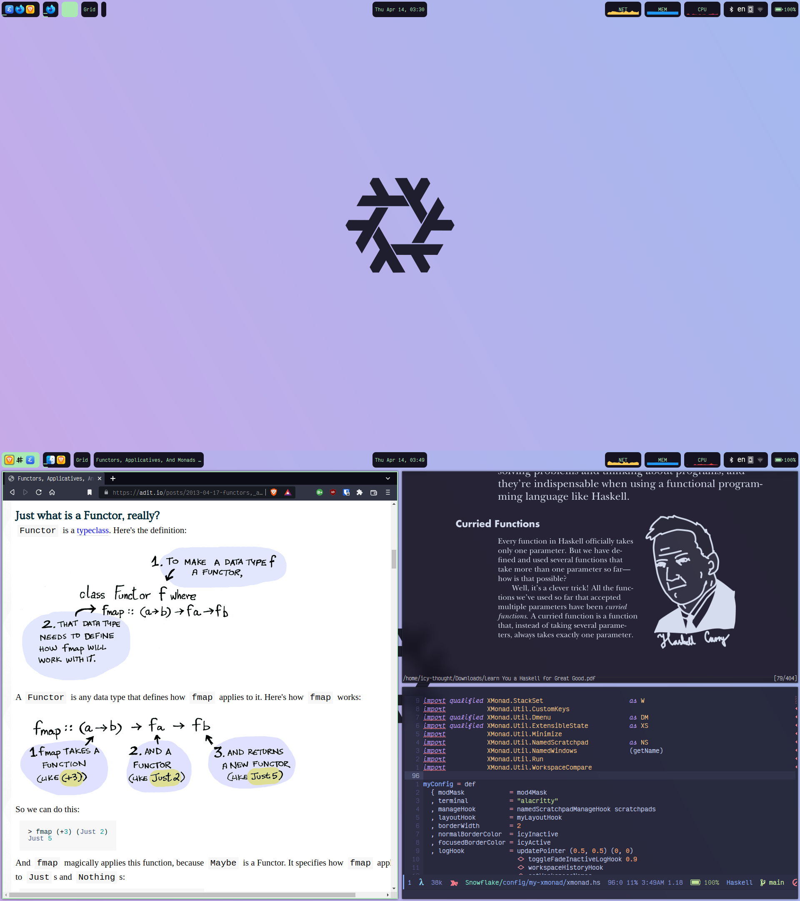

# (def) XMonad
> A dynamically tiling X11 window manager that is written and configured in
> Haskell. - [XMonad](https://xmonad.org)

## Keybindings

### Definitions:
- <kbd>M</kbd> = <kbd>super</kbd> (Windows-Key)
- <kbd>A</kbd> = <kbd>Alt</kbd>
- <kbd>S</kbd> = <kbd>Shift</kbd>
- <kbd>H</kbd> = <kbd>Hyper</kbd> (right-ctrl)

### Action Keybindings

### Window Movement Keybindings

### Workspace Movement Keybindings

### Screen Movement Keybindings
