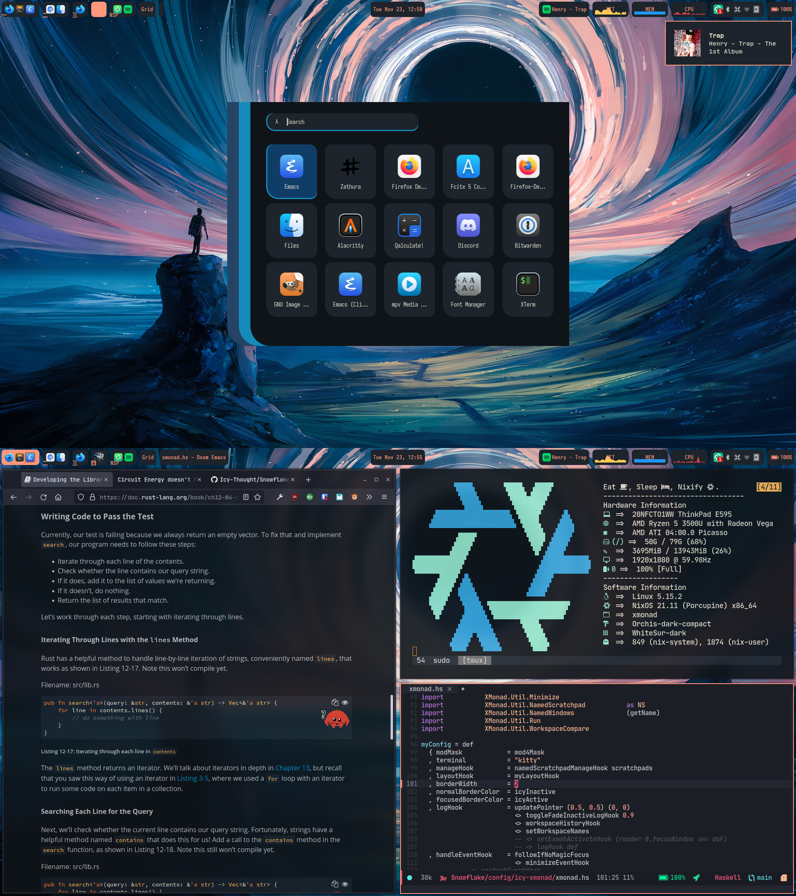
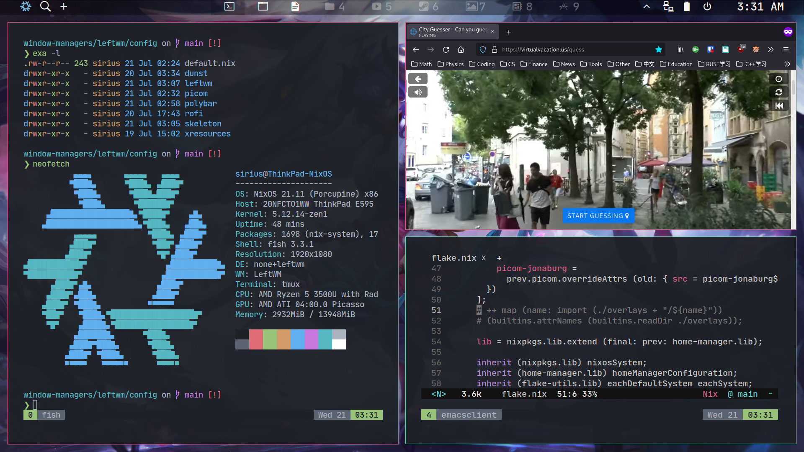

# Introduction
The following folder contains several WM's tried throughout the years of my NixOS usage. Hopefully you'll find something that attracts you to NixOS here and start using it.

# Table of Contents
- [Introduction](#introduction)
- [Xmonad](#xmonad)
  - [Keybindings](#keybindings)
- [LeftWM](#leftwm)
- [BSPWM](#bspwm)
- [Special Thanks](#special-thanks)

# Xmonad

## Keybindings
*Credits:* [micrub](https://gist.github.com)/[xmonad-default-key-bindings.md](https://gist.github.com/micrub/aeebe7eb4d2df9e5e203e76a0fd89542)

Definitions:
- <kbd>modm</kbd> = <kbd>super</kbd> (windows key)
- <kbd>modalt</kbd> = <kbd>super</kbd> + <kbd>alt</kbd>
- <kbd>hyper</kbd> = <kbd>super</kbd> + <kbd>ctrl</kbd> + <kbd>shift</kbd>

### Action Keybindings

| Key binding                                            | Action                                                                         |
|--------------------------------------------------------|--------------------------------------------------------------------------------|
| <kbd>modm</kbd> + <kbd>shift</kbd> + <kbd>/</kbd>      | Run xmessage with a summary of the default keybindings. (useful for beginners) |
| <kbd>modm</kbd> + <kbd>shift</kbd> + <kbd>return</kbd> | Launch terminal. (Alacritty)                                                   |
| <kbd>modm</kbd> + <kbd>alt</kbd> + <kbd>f</kbd>        | Launch Firefox Browser.                                                        |
| <kbd>modm</kbd> + <kbd>alt</kbd> + <kbd>h</kbd>        | Launch htop.                                                                   |
| <kbd>modm</kbd> + <kbd>alt</kbd> + <kbd>s</kbd>        | Launch Spotify.                                                                |
| <kbd>modm</kbd> + <kbd>p</kbd>                         | Invoke rofi to select an application specified in a desktop file.              |
| <kbd>modm</kbd> + <kbd>g</kbd>                         | Invoke rofi to select a window to which the focus will be shifted to.          |
| <kbd>modm</kbd> + <kbd>b</kbd>                         | Invoke rofi to bring window to current workspace.                              |
| <kbd>modm</kbd> + <kbd>shift</kbd> + <kbd>b</kbd>      | Invoke rofi to select window to replace with active window.                    |
| <kbd>hyper</kbd> + <kbd>l</kbd>                        | Invoke rofi to select from available layouts.                                  |
| <kbd>modm</kbd> + <kbd>shift</kbd> + <kbd>c</kbd>      | Close the focused window.                                                      |
| <kbd>modm</kbd> + <kbd>shift</kbd> + <kbd>q</kbd>      | Quit Xmonad.                                                                   |
| <kbd>modm</kbd> + <kbd>q</kbd>                         | Restart Xmonad.                                                                |

### Window Movement Keybindings

| Key binding                                               | Action                                                                           |
|-----------------------------------------------------------|----------------------------------------------------------------------------------|
| <kbd>modm</kbd> + <kbd>space</kbd>                        | Rotate through the available layout algorithms.                                  |
| <kbd>modm</kbd> + <kbd>shift</kbd> + <kbd>space</kbd>     | Reset the layouts on the current workspace to default.                           |
| <kbd>modm</kbd> + <kbd>n</kbd>                            | Resize viewed windows to the correct size.                                       |
| <kbd>modm</kbd> + <kbd>tab</kbd>                          | Move focus to the next window.                                                   |
| <kbd>modm</kbd> + <kbd>shift</kbd> + <kbd>tab</kbd>       | Move focus to the previous window.                                               |
| <kbd>modm</kbd> + <kbd>{h,j,k,l}</kbd>                    | Move to an adjacent window in the direction associated with the pressed vim-key. |
| <kbd>modm</kbd> + <kbd>m</kbd>                            | Minimize active window.                                                          |
| <kbd>modm</kbd> + <kbd>shift</kbd> + <kbd>m</kbd>         | Maximize active window.                                                          |
| <kbd>modm</kbd> + <kbd>return</kbd>                       | Swap focused window with master window.                                          |
| <kbd>modm</kbd> + <kbd>shift</kbd> + <kbd>{h,j,k,l}</kbd> | Swap focused window with window in the input direction.                          |
| <kbd>modm</kbd> + <kbd>comma</kbd>                        | Increment the number of windows in the master area.                              |
| <kbd>modm</kbd> + <kbd>period</kbd>                       | Deincrement the number of windows in the master area.                            |
| <kbd>modm</kbd> + <kbd>shift</kbd> + <kbd>z</kbd>         | Move active window to an empty workspace.                                        |
| <kbd>modm</kbd> + <kbd>shift</kbd> + <kbd>h</kbd>         | Move active window to an empty workspace and change to that workspace.           |
| <kbd>modm</kbd> + <kbd>ctrl</kbd> + <kbd>space</kbd>      | Activates/Deactivates fullscreen for active window.                              |
| <kbd>modm</kbd> + <kbd>x</kbd>                            | Sends active window to hidden workspace.                                         |
| <kbd>modm</kbd> + <kbd>alt</kbd> + <kbd>space</kbd>       | Minimizes everything else but active window class.                               |
| <kbd>hyper</kbd> + <kbd>g</kbd>                           | Gather the class of the active window to the current workspace.                  |

### Window Movement Mouse Keybindings

| Binding                              | Action                                                  |
|--------------------------------------|---------------------------------------------------------|
| <kbd>modm</kbd> + <kbd>button1</kbd> | Set the window to floating mode and move by dragging.   |
| <kbd>modm</kbd> + <kbd>button3</kbd> | Set the window to floating mode and resize by dragging. |
| <kbd>modm</kbd> + <kbd>button2</kbd> | Raise the window to the top of the stack.               |

### Workspace Movement Keybindings

| Key binding                                            | Action                                    |
|--------------------------------------------------------|-------------------------------------------|
| <kbd>modm</kbd> + <kbd>[1..9]</kbd>                    | Switch to workspace N.                    |
| <kbd>modm</kbd> + <kbd>shift</kbd> + <kbd>[1..9]</kbd> | Move client to workspace N.               |
| <kbd>hyper</kbd> + <kbd>e                              | Move to empty workspace.                  |
| <kbd>modm</kbd> + <kbd>\\</kbd>                        | Cycles through current workspace history. |

### Screen Movement Keybindings

| Key binding                                             | Action                                          |
|---------------------------------------------------------|-------------------------------------------------|
| <kbd>modm</kbd> + <kbd>{w,e,r}</kbd>                    | Switch to physical/Xinerama screens 1, 2, or 3. |
| <kbd>modm</kbd> + <kbd>shift</kbd> + <kbd>{w,e,r}</kbd> | Move client to screen 1, 2, or 3.               |

# LeftWM

# BSPWM

# Special Thanks
- [IvanMalison](https://github.com/IvanMalison): Xmonad Setup.
- [Taylor85345](https://github.com/taylor85345/leftwm-theme-garden): LeftWM Garden.
